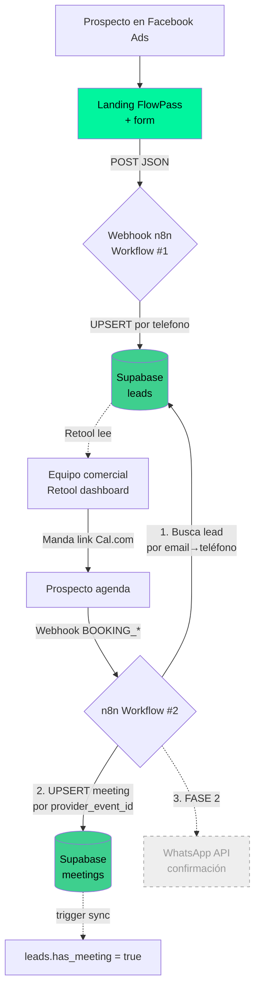

# FlowPass CRM V1 — Dev Spec (Fase 1)

## 👋 Hola, dev — léeme primero

Este doc es tu guía paso a paso para terminar la primera fase del CRM de FlowPass. Asumimos que recién estás empezando, así que **nada se da por entendido**. Si una palabra no la conoces, mira el **Glosario** al final del doc (sección 11).

### Qué harás (resumen)

1. Correrás 4 bloques de SQL en Supabase para agregar columnas y crear 2 tablas nuevas.
2. Editarás 1 workflow que ya existe en n8n (Leads) para que no duplique data.
3. Crearás 1 workflow nuevo en n8n (Cal.com → Meetings).
4. Conectarás Retool al Supabase para que el equipo comercial vea todo.

**⏱️ Estimado:** 1–2 días de trabajo enfocado.

### Antes de empezar, asegúrate de tener acceso a:
- [ ] **Supabase** del proyecto FlowPass CRM (pide a Grecia el link + credenciales).
- [ ] **n8n** donde corren los workflows actuales (pide acceso + workflow `crm_landing_leads`).
- [ ] **Cal.com** cuenta admin para crear webhooks.
- [ ] **Retool** acceso de editor.
- [ ] **Este repo** (FlowPass-landing) clonado, sólo para leer el form (no se modifica).

### Cómo está organizado este doc

| Sección | Para qué sirve |
|---------|----------------|
| 1, 2 | Contexto general y entregables |
| 2.bis | Diagrama visual del flujo |
| 3 | SQL que tienes que correr en Supabase (con explicaciones) |
| 4 | Cómo arreglar el workflow de Leads en n8n |
| 5 | Cómo crear el workflow nuevo de Meetings en n8n |
| 6 | Variables de entorno que necesitas configurar |
| 7 | Cómo es el JSON que llega del form (referencia) |
| 8 | Por qué tomamos cada decisión de diseño |
| 9 | Lo que NO va en esta fase |
| 10 | Checklist de pruebas antes de cerrar |
| 11 | Glosario de términos técnicos |
| 12 | Decisiones pendientes (preguntar a Grecia antes de avanzar) |

### Stack que usamos hoy (no cambies nada de esto)

| Pieza | Herramienta | Por qué |
|-------|-------------|---------|
| Frontend del form | SvelteKit (landing) | Ya en producción. **NO tocar.** |
| Orquestación | **n8n** | Es lo que ya usamos. Todo lo de backend va acá. |
| Base de datos | Supabase (Postgres) | Proyecto CRM ya creado. |
| Dashboard comercial | Retool | Conecta directo a Supabase. |
| Agenda | Cal.com | Manda webhook a n8n. |
| WhatsApp | Meta Cloud API | ⏳ **Fase 2**. Esperando token. |

### Reglas que NO debes romper

1. ⚠️ **El form de la landing NO se toca.** Ya envía todos los campos correctos (sección 7).
2. ⚠️ **Toda la lógica nueva va en n8n.** No crees endpoints en SvelteKit ni Functions de Supabase para esto.
3. ⚠️ **Cuando edites el workflow de Leads, NO toques los campos blandos** (`status`, `priority`, `notes`, etc.). Esos los maneja el equipo comercial desde Retool.
4. ⚠️ **Idempotencia siempre.** Webhooks se reenvían. Toda inserción debe ser UPSERT.
5. ⚠️ **Lee la sección 9.bis "Decisiones tomadas" ANTES de programar.** Define cómo se marcan meetings, routing PE/MX y asignación de leads. Es la regla, no opcional.
6. ⚠️ **Usuarios viven en `auth.users` de Supabase.** No crees tabla `users` propia. Usa `public.profiles` que extiende `auth.users` (ver sección 3.2 bloque A).

### Buenas prácticas que esperamos en toda la implementación

Este CRM es la fuente de verdad del proceso comercial. Cada decisión técnica afecta data real de prospectos. Por favor sigue estas prácticas — no son opcionales:

#### 🔒 Seguridad
- ✅ Toda credencial en variables de entorno de n8n. **Nunca hardcoded.**
- ✅ Webhook Cal.com con validación de firma HMAC (`X-Cal-Signature-256`) usando `CAL_COM_WEBHOOK_SECRET`.
- ✅ Webhook del form: si más adelante lo abrimos, agregar rate-limit + token. Por ahora confiamos en n8n cloud.
- ✅ Usa `SERVICE_ROLE_KEY` solo en n8n. Nunca exponerla al cliente.

#### 🗄️ Base de datos
- ✅ **Migraciones reversibles.** Todo cambio de schema vía `ALTER TABLE` documentado, nunca `DROP + CREATE` sobre tabla viva.
- ✅ Cada migración con `IF NOT EXISTS` / `IF EXISTS` para ser idempotente — la puedes correr 2 veces sin romper.
- ✅ FKs explícitas (no `text` con id pegado a la libre).
- ✅ Índices en columnas que se filtran/joinan con frecuencia (ya documentados en sección 3.2).
- ✅ Triggers para invariantes (ej. `has_meeting` sync) — no confiar en que la app lo actualice.

#### 🔁 Workflows n8n
- ✅ **Idempotencia obligatoria.** Cada UPSERT con clave estable (`telefono`, `provider_event_id`).
- ✅ **Manejo de error en cada nodo crítico**: rama `On Error` que loguee a un canal (Slack / tabla `error_log` / Sentry) en vez de fallar silencioso.
- ✅ Nombres de workflows en `snake_case`: `crm_landing_leads`, `crm_calcom_meetings`, `crm_whatsapp_reminders`.
- ✅ Nombres de nodos descriptivos: `Upsert Lead`, `Lookup Lead by Email`, no `Postgres1`, `Postgres2`.
- ✅ Versionar los workflows: exportar JSON y commitearlo a este repo bajo `docs/n8n/` después de cada cambio.
- ✅ Variables sensibles → **Credentials de n8n**, no hardcoded en nodos.

#### 📦 Datos
- ✅ Teléfonos siempre en formato **E.164** (`+51999888777`). Si Cal.com manda otro formato, normaliza antes con `libphonenumber` o función similar.
- ✅ Timestamps siempre en **UTC** en la BD. La columna `timezone` guarda la TZ original para mostrar.
- ✅ Emails siempre `.toLowerCase().trim()` antes de insertar/buscar.
- ✅ Nunca borrar leads/meetings con `DELETE`. Si hay que ocultar, agregar columna `archived_at`.

#### 📊 Observabilidad
- ✅ Cada workflow loguea en n8n executions (ya viene de fábrica) — asegúrate que el modo sea `Save execution data: All` para los críticos.
- ✅ Agregar un nodo final `Respond to Webhook` con código 200 + body JSON `{ok:true, lead_id, meeting_id}` para debug.
- ✅ Errores → tabla `error_log` o canal Slack del equipo.

#### 🧪 Pruebas
- ✅ Antes de marcar terminado, completa el checklist de QA (sección 10).
- ✅ Prueba con un teléfono real tuyo. Resubmit. Verifica que `submission_count = 2` y que el resto de campos comerciales NO se tocaron.
- ✅ Para Cal.com: usa el botón "Test" del webhook de Cal.com y verifica que `provider_event_id` queda guardado y un segundo trigger del mismo evento NO duplica.

---

> **Scope de este doc:** entregar Leads + Meetings funcionales **sin WhatsApp** (API pendiente).
> Cuando llegue el Permanent Access Token de Meta, se agrega Fase 2.

---

## 1. Resumen

Fase 1 cubre:

1. ✅ ~~Migrar el workflow de Leads a un nuevo proyecto Supabase (CRM).~~ **YA HECHO** — vive en producción.
2. Implementar el flujo **Cal.com → n8n → Supabase (meetings)**.
3. Aplicar mejoras al schema actual (ver sección 3).
4. Dejar el modelo listo para Fase 2 (WhatsApp + recordatorios).

WhatsApp queda **fuera de scope** en esta entrega.

---

## 2.bis Flujo visual

> Diagrama Mermaid — GitHub y la mayoría de visores Markdown lo renderizan automático.



**Lectura:**
- **Verde sólido** = ya funcionando o nuevo en esta fase.
- **Línea punteada gris** = Fase 2 (WhatsApp), no se toca ahora.
- **Líneas punteadas** = lectura/efecto secundario (Retool consume, trigger reacciona).

### Reglas de oro del flujo

1. **Form ya envía todo lo necesario.** Si un campo no se guarda, la culpa NO está en el front — está en el mapeo del nodo Supabase de n8n. Revisar nombres exactos del payload (sección 7).
2. **`telefono` es la identidad del lead.** Email puede venir vacío. Toda búsqueda primero por email, fallback por `telefono` E.164.
3. **Idempotencia siempre.** Webhooks se reenvían. Cualquier INSERT debe ser UPSERT con clave estable (`telefono` para leads, `provider_event_id` para meetings).
4. **El comercial es dueño de los campos blandos.** Workflows nunca pisan: `status`, `priority`, `assigned_user_id`, `notes`, `dormancy`, `last_contacted_at`, `next_followup_at`.

---

## 2. Entregables

| # | Entregable | Responsable | Estado |
|---|------------|-------------|--------|
| 1 | Proyecto Supabase CRM creado | Dev | ✅ Hecho |
| 2 | Workflow n8n Leads apuntando al nuevo Supabase | Dev | ✅ Hecho |
| 3 | ALTERs sobre schema actual (users FK, dormancy, submission_count, triggers, índices) | Dev | Pendiente |
| 4 | Tabla `meetings` + `whatsapp_messages` stub creadas | Dev | Pendiente |
| 5 | UPSERT en workflow Leads (evitar duplicados por `telefono`) | Dev | Pendiente |
| 6 | Workflow n8n Cal.com → meetings | Dev | Pendiente |
| 7 | Variables de entorno documentadas en `.env` (n8n) | Dev | Pendiente |
| 8 | Retool conectado para vista comercial básica | Dev | Pendiente |

---

## 3. Schema — estado actual + cambios

### 3.1 Ya en producción
- ✅ `leads` ya creada y recibiendo datos del form.
- ✅ `meetings` ya creada (vacía o casi vacía, sin webhook conectado todavía).
- ❌ `users` **aún no** existe.
- ❌ `whatsapp_messages` **aún no** existe.

**Por eso este sprint son sólo `ALTER TABLE` + 2 `CREATE TABLE` nuevos** — no se recrean leads ni meetings.

### 3.2 Migraciones a aplicar

Aplicar en este orden. Cada bloque es idempotente o seguro contra estado parcial.

```sql
-- ─────────────────────────────────────────────
-- A) PROFILES (datos de equipo comercial) — NUEVA
--
-- IMPORTANTE: los usuarios YA EXISTEN en `auth.users` de Supabase
-- (grecia.delgado@flow-pass.com, piero.varillas@flow-pass.com).
-- Esta tabla EXTIENDE auth.users con info que necesita el CRM.
-- ─────────────────────────────────────────────
CREATE TABLE IF NOT EXISTS public.profiles (
  id uuid PRIMARY KEY REFERENCES auth.users(id) ON DELETE CASCADE,
  created_at timestamptz NOT NULL DEFAULT now(),
  full_name text NOT NULL,
  role text NOT NULL DEFAULT 'sales' CHECK (role IN ('admin','sales','ops')),
  active boolean NOT NULL DEFAULT true
);

-- Seed inicial: rellenar para los 2 users actuales.
-- Reemplaza los UUIDs por los que se ven en Supabase Auth.
INSERT INTO public.profiles (id, full_name, role)
VALUES
  ('c72bb59a-ccdf-4a52-8350-1b56fa8c3f84', 'Grecia Delgado', 'admin'),
  ('f5354dc3-3fa7-44dd-b281-3a7504432d8d', 'Piero Varillas', 'sales')
ON CONFLICT (id) DO NOTHING;

-- ─────────────────────────────────────────────
-- B) LEADS — ALTERs sobre tabla existente
-- ─────────────────────────────────────────────

-- B.1) Agregar dormancy (separar de status)
ALTER TABLE public.leads
  ADD COLUMN IF NOT EXISTS dormancy text NOT NULL DEFAULT 'active'
    CHECK (dormancy IN ('active','dormant','re_engaged'));

-- B.2) Migrar status -> sólo lifecycle puro (sin dormido/re_engaged)
-- Primero mover valores actuales:
UPDATE public.leads SET dormancy = 'dormant', status = 'contacted'
  WHERE status = 'dormido';
UPDATE public.leads SET dormancy = 're_engaged', status = 'contacted'
  WHERE status = 're_engaged';

-- Luego endurecer el CHECK de status:
ALTER TABLE public.leads DROP CONSTRAINT IF EXISTS leads_status_check;
ALTER TABLE public.leads
  ADD CONSTRAINT leads_status_check
  CHECK (status IN ('new','contacted','qualified','won','lost'));

-- B.3) submission_count (detectar resubmits del form)
ALTER TABLE public.leads
  ADD COLUMN IF NOT EXISTS submission_count int NOT NULL DEFAULT 1;

-- B.4) assigned_to: pasar de text a uuid FK contra auth.users
-- (vía profiles.id, que es el mismo UUID).
-- Estrategia segura: agregar columna nueva, mantener vieja un sprint, migrar a mano.
ALTER TABLE public.leads
  ADD COLUMN IF NOT EXISTS assigned_user_id uuid REFERENCES auth.users(id);
-- Cuando esté migrado y validado:
--   ALTER TABLE leads DROP COLUMN assigned_to;
--   ALTER TABLE leads RENAME COLUMN assigned_user_id TO assigned_to;

-- B.5) Índices faltantes
CREATE INDEX IF NOT EXISTS leads_email_idx ON public.leads (email);
CREATE INDEX IF NOT EXISTS leads_status_priority_idx ON public.leads (status, priority);
CREATE INDEX IF NOT EXISTS leads_next_followup_idx ON public.leads (next_followup_at);
CREATE INDEX IF NOT EXISTS leads_assigned_idx ON public.leads (assigned_user_id);

-- ─────────────────────────────────────────────
-- C) MEETINGS — ALTERs sobre tabla existente
-- (la tabla ya tiene todas las columnas base, sólo falta:
--  recordatorios + UNIQUE de idempotencia + índices)
-- ─────────────────────────────────────────────

-- C.1) Columnas para Fase 2 (recordatorios). Crearlas YA evita migrar viva.
ALTER TABLE public.meetings
  ADD COLUMN IF NOT EXISTS reminder_24h_sent_at timestamptz,
  ADD COLUMN IF NOT EXISTS reminder_1h_sent_at  timestamptz;

-- C.2) IDEMPOTENCIA — CRÍTICO antes de conectar webhook Cal.com.
-- Sin esto, un reenvío del webhook crea filas duplicadas.
CREATE UNIQUE INDEX IF NOT EXISTS meetings_provider_event_uq
  ON public.meetings (provider, provider_event_id)
  WHERE provider_event_id IS NOT NULL;

-- C.3) Índices de performance
CREATE INDEX IF NOT EXISTS meetings_lead_idx ON public.meetings (lead_id);
CREATE INDEX IF NOT EXISTS meetings_starts_idx ON public.meetings (starts_at)
  WHERE status = 'scheduled';

-- ─────────────────────────────────────────────
-- D) WHATSAPP MESSAGES — NUEVA
-- (stub Fase 2 — crear ya para evitar migrar después)
-- ─────────────────────────────────────────────
CREATE TABLE IF NOT EXISTS public.whatsapp_messages (
  id uuid PRIMARY KEY DEFAULT gen_random_uuid(),
  created_at timestamptz NOT NULL DEFAULT now(),
  lead_id uuid NOT NULL REFERENCES public.leads(id) ON DELETE CASCADE,
  meeting_id uuid REFERENCES public.meetings(id) ON DELETE SET NULL,
  direction text NOT NULL CHECK (direction IN ('inbound','outbound')),
  template_name text,
  body text,
  wa_message_id text UNIQUE,
  status text,           -- sent | delivered | read | failed
  error_message text,
  phone_number_id text,  -- Perú o MX
  metadata jsonb
);

CREATE INDEX wa_lead_idx ON public.whatsapp_messages (lead_id);

-- ─────────────────────────────────────────────
-- TRIGGERS
-- ─────────────────────────────────────────────

-- updated_at auto
CREATE OR REPLACE FUNCTION public.touch_updated_at()
RETURNS trigger AS $$
BEGIN NEW.updated_at = now(); RETURN NEW; END;
$$ LANGUAGE plpgsql;

CREATE TRIGGER leads_touch BEFORE UPDATE ON public.leads
  FOR EACH ROW EXECUTE FUNCTION public.touch_updated_at();
CREATE TRIGGER meetings_touch BEFORE UPDATE ON public.meetings
  FOR EACH ROW EXECUTE FUNCTION public.touch_updated_at();

-- has_meeting sync
CREATE OR REPLACE FUNCTION public.sync_has_meeting()
RETURNS trigger AS $$
BEGIN
  IF TG_OP = 'INSERT' THEN
    UPDATE public.leads SET has_meeting = true WHERE id = NEW.lead_id;
  ELSIF TG_OP = 'DELETE' THEN
    UPDATE public.leads SET has_meeting = EXISTS (
      SELECT 1 FROM public.meetings WHERE lead_id = OLD.lead_id
    ) WHERE id = OLD.lead_id;
  END IF;
  RETURN NULL;
END;
$$ LANGUAGE plpgsql;

CREATE TRIGGER meetings_sync_has_meeting
  AFTER INSERT OR DELETE ON public.meetings
  FOR EACH ROW EXECUTE FUNCTION public.sync_has_meeting();
```

### 3.3 Diccionario — qué guarda cada item y por qué

> **CRÍTICO:** lee esto antes de tocar nada. La data del CRM es la única fuente de verdad del proceso comercial. Si un campo se guarda mal o queda vacío, perdemos contexto que no se recupera.

#### Tabla `leads`

| Campo | Para qué | Reglas |
|-------|----------|--------|
| `id` | UUID interno, único por persona | Generado automático, no tocar. |
| `created_at` | Cuándo entró el lead la **primera vez** | NUNCA actualizar en resubmits. |
| `updated_at` | Última modificación | Lo mueve el trigger `leads_touch`. |
| `nombre` / `apellido` | Saludo y personalización en WhatsApp | Validado en el form (regex letras). |
| `email` | Canal secundario + match con Cal.com | Puede ser `NULL`. NO único. |
| `telefono` | **Identidad del lead.** WhatsApp principal | Formato E.164 (`+51...`). UNIQUE. |
| `pais_telefono` | Texto humano del país del número | `Perú`, `México`, etc. Lo manda el form. |
| `pais` | País donde opera el negocio (no el del tel) | Puede diferir de `pais_telefono`. |
| `negocio` | Nombre comercial de la academia | Para mensajes personalizados. |
| `tipo_academia` | Vertical (Gimnasio, Pilates, etc) | Segmentación de campañas. |
| `situacion` | Si ya tiene academia abierta o no | Filtra leads no-cualificables. |
| `rol` | Dueño / Coach / Staff / Alumno | Sólo "Dueño" es lead caliente. |
| `alumnos` | Tamaño aproximado | Define plan a ofrecer. |
| `usa_software` | bool — ya usa competidor | Argumento de venta distinto. |
| `fuente` | Cómo nos conoció (atribución soft) | Anuncio / Google / Recomendación. |
| `origen` | Atribución técnica | `n8n_form` (landing) o `cal_com_orphan`. |
| `status` | **Lifecycle comercial.** Sólo lo toca Retool | new→contacted→qualified→won/lost. |
| `dormancy` | Estado de actividad ortogonal a status | active / dormant / re_engaged. |
| `priority` | Temperatura del lead | hot / warm / cold / skip. |
| `assigned_user_id` | Comercial asignado (FK a `auth.users.id`) | NULL = no asignado. Se asigna **manual** desde Retool (ver 9.bis Decisión 3). |
| `last_contacted_at` | Última vez que comercial habló | Manual desde Retool. |
| `next_followup_at` | Próximo seguimiento programado | Cron de recordatorios lo lee. |
| `notes` | Texto libre comercial | NO sobreescribir desde workflows. |
| `utm_source/medium/campaign/content` | Atribución de campaña | Vienen del form, no sobreescribir si llegan vacíos en resubmit. |
| `referrer` | URL de origen del tráfico | Solo primer submit. |
| `promo_code` | Código de promo capturado de URL | Para descuentos. |
| `source_id` | ID externo libre (futuro) | No usado todavía. |
| `has_meeting` | Atajo: ¿tiene al menos 1 meeting? | **No tocar manual** — lo sincroniza trigger. |
| `submission_count` | Cuántas veces resubmiteó el form | Señal de interés. UPSERT lo incrementa. |

#### Tabla `meetings`

| Campo | Para qué | Reglas |
|-------|----------|--------|
| `id` | UUID interno | Auto. |
| `lead_id` | FK al prospecto | Obligatorio. ON DELETE CASCADE. |
| `activity_type` | Tipo de reunión | Default `sales_demo`. |
| `status` | Estado de la reunión | scheduled→completed/cancelled/no_show. |
| `title` / `description` | Lo que se ve en el calendario | Viene del payload Cal.com. |
| `starts_at` / `ends_at` | Cuándo es | Siempre UTC en la BD. |
| `timezone` | TZ original para mostrar al comercial | `America/Lima` o `America/Mexico_City`. |
| `meeting_url` | Link de la videollamada | Google Meet / Zoom desde Cal.com. |
| `provider` | Qué sistema creó la meeting | `cal_com` casi siempre. |
| `provider_event_id` | **ID único del booking en Cal.com** | Llave de idempotencia. NO duplicar. |
| `cancel_reason` / `cancelled_at` | Si se canceló, por qué y cuándo | Llenar sólo al cancelar. |
| `completed_at` | Marcado manual cuando termina | Manual desde Retool (botón "Marcar completada" — ver 9.bis Decisión 1). |
| `reminder_24h_sent_at` / `reminder_1h_sent_at` | Anti-duplicado recordatorios | Fase 2 los llena. |
| `metadata` | Payload Cal.com completo (JSONB) | Útil para debug futuro. |

#### Tabla `profiles` (extiende `auth.users`)
| Campo | Para qué | Reglas |
|-------|----------|--------|
| `id` | UUID que coincide con `auth.users.id` | FK obligatoria a `auth.users`. |
| `full_name` | Nombre que se muestra en Retool | "Grecia Delgado", "Piero Varillas". |
| `role` | `admin` / `sales` / `ops` | Para permisos futuros. |
| `active` | Si el comercial sigue activo | Filtrar en dropdown de Retool. |

Los **emails y autenticación** viven en `auth.users` (Supabase Auth). Nunca dupliques email acá. Para mostrar el email en Retool, hacer JOIN: `profiles JOIN auth.users ON profiles.id = auth.users.id`.

#### Tabla `whatsapp_messages`
Stub Fase 2. Vacía por ahora pero ya creada para que cuando llegue el token, no haya que migrar viva.

---

## 4. Workflow n8n #1 — Landing → Lead

### Estado actual
- ✅ Webhook POST consumiendo el form (`PUBLIC_N8N_LEADS_WEBHOOK`).
- ✅ Conectado al nuevo proyecto Supabase CRM.
- ⚠️ Hace `INSERT` plano. **Falta cambiar a UPSERT** para no perder datos cuando el lead resubmitea.

### Qué hacer (paso a paso en n8n)

**Cambiar el nodo INSERT por UPSERT por `telefono`.**

**¿Por qué?** Si el mismo prospecto rellena el form 2 veces (común: una desde móvil, otra desde desktop), el `INSERT` falla con violación de UNIQUE constraint y se **pierde la nueva información** (puede ser que actualice su email, su negocio, su tipo de academia, etc). El UPSERT actualiza los datos blandos y suma 1 a `submission_count`, dejando intacto el trabajo del comercial (status, priority, notes, assigned).

**Cómo hacerlo en n8n — 2 opciones:**

#### Opción A (recomendada): Nodo "Supabase" con operación Upsert
1. Abre el workflow de Leads en n8n.
2. Selecciona el nodo Supabase actual (el que hace Insert).
3. Cambia **Operation** de `Insert` a `Upsert`.
4. **Conflict columns:** `telefono`.
5. Mapea cada campo del payload a la columna correspondiente (los nombres coinciden 1:1 con sección 7).
6. ⚠️ **NO mapees** `status`, `priority`, `assigned_user_id`, `notes`, `last_contacted_at`, `next_followup_at`, `dormancy`. El UPSERT debe ignorarlos en updates.

#### Opción B (más control): Nodo "Postgres" con query custom
Si el nodo Supabase no te deja excluir columnas en el UPDATE, usa un nodo Postgres y ejecuta la query de abajo. Mapea `$1, $2, ...` a los valores del payload.

Query:

```sql
-- ¿Qué hace esta query?
-- 1. Intenta INSERTAR un lead nuevo con todos sus datos.
-- 2. Si ya existe un lead con ese `telefono` (UNIQUE constraint),
--    en vez de fallar, ACTUALIZA los campos blandos (nombre, negocio, etc).
-- 3. Suma 1 a `submission_count` para saber cuántas veces resubmiteó.
-- 4. NUNCA toca `status`, `priority`, `notes`, etc. — esos son del comercial.
-- 5. NUNCA pisa atribución original (`fuente`, `referrer`, UTMs).

INSERT INTO leads (
  nombre, apellido, email, telefono, pais_telefono, pais,
  negocio, tipo_academia, situacion, rol, alumnos, usa_software,
  fuente, origen, utm_source, utm_medium, utm_campaign, utm_content,
  referrer, promo_code
) VALUES ($1, $2, ... )
ON CONFLICT (telefono) DO UPDATE SET
  -- Datos personales: refresca con lo nuevo (puede haber corregido un typo)
  nombre = EXCLUDED.nombre,
  apellido = EXCLUDED.apellido,
  email = COALESCE(EXCLUDED.email, leads.email),  -- solo si llega no-vacío
  pais = EXCLUDED.pais,

  -- Cualificación del negocio: refresca (puede haber cambiado)
  negocio = EXCLUDED.negocio,
  tipo_academia = EXCLUDED.tipo_academia,
  situacion = EXCLUDED.situacion,
  rol = EXCLUDED.rol,
  alumnos = EXCLUDED.alumnos,
  usa_software = EXCLUDED.usa_software,

  -- ATRIBUCIÓN: NUNCA pisar. Lo que vale es el primer touch.
  -- fuente, referrer, utm_*, promo_code → NO se actualizan.

  -- Métrica de interés
  submission_count = leads.submission_count + 1,
  updated_at = now()
RETURNING id;
```

> 💡 **Por qué no actualizamos atribución (`fuente`, `referrer`, UTMs):**
> Si el lead vino por Facebook Ads primero y después lo buscó por Google, el valor real para marketing es saber que el **primer contacto fue Facebook Ads**. Si pisamos, perdemos esa señal.

**Regla crítica:** NO sobreescribir `status`, `priority`, `assigned_user_id`, `notes`, `last_contacted_at`, `next_followup_at`, `dormancy`. Esos los maneja el equipo comercial — si los sobreescribes, **pierdes el trabajo de seguimiento**.

**Responder 200 OK** al webhook siempre que la query haya corrido (el form ya valida los campos, no necesitas re-validar en n8n).

---

## 5. Workflow n8n #2 — Cal.com → Meeting

### Setup inicial en n8n
1. Crea un nuevo workflow en n8n llamado `crm_calcom_meetings`.
2. Primer nodo: **Webhook** (método POST, path libre — copia la URL que genera n8n).
3. En Cal.com:
   - Settings → Developer → Webhooks → **New webhook**.
   - URL: la del nodo n8n (en producción, no la de test).
   - Eventos a suscribir: `BOOKING_CREATED`, `BOOKING_RESCHEDULED`, `BOOKING_CANCELLED`.
   - Secret: genera uno y guárdalo como `CAL_COM_WEBHOOK_SECRET` en n8n.
4. (Opcional pero recomendado) Agrega un nodo **Function** justo después del Webhook que valide la firma HMAC del header `X-Cal-Signature-256` contra el secret. Si falla, devuelve 401.

### Pasos del workflow

**Paso 1 — Identificar lead**

Cal.com payload trae `payload.attendees[0].email` y a veces `payload.attendees[0].phoneNumber`.

En n8n usa **2 nodos Postgres seguidos** (o un `IF` con 2 ramas):

```sql
-- a) por email exacto
SELECT id FROM leads WHERE email = $email LIMIT 1;

-- b) si no, por telefono E.164 (normalizar antes con un nodo Function:
--    quitar espacios, asegurar prefijo +)
SELECT id FROM leads WHERE telefono = $phone_e164 LIMIT 1;
```

**Si NO existe lead:** crear uno con `origen = 'cal_com_orphan'`, rellenando lo que venga del payload. Marca para revisión manual:

```sql
INSERT INTO leads (
  nombre, apellido, email, telefono, pais_telefono, pais,
  negocio, tipo_academia, situacion, rol, alumnos, usa_software,
  fuente, origen, notes
) VALUES (
  $nombre, $apellido, $email, $telefono, 'Desconocido', 'Desconocido',
  '—', 'Otros', 'No, solo busco dónde entrenar/estudiar', 'Alumno',
  'Aún no está abierto', false, 'Cal.com', 'cal_com_orphan',
  'Lead creado desde Cal.com — verificar datos manualmente'
)
RETURNING id;
```

> 💡 **Tip n8n:** mete este insert en un nodo Postgres separado, conectado por la rama "False" del IF de búsqueda. Así no se ejecuta si ya existe.

**Paso 2 — UPSERT meeting (idempotente)**

```sql
INSERT INTO meetings (
  lead_id, activity_type, status, title, description,
  starts_at, ends_at, timezone, meeting_url,
  provider, provider_event_id, metadata
) VALUES (
  $lead_id, 'sales_demo', $status, $title, $description,
  $starts_at, $ends_at, $timezone, $meeting_url,
  'cal_com', $cal_booking_uid, $raw_payload_jsonb
)
ON CONFLICT (provider, provider_event_id) DO UPDATE SET
  status = EXCLUDED.status,
  starts_at = EXCLUDED.starts_at,
  ends_at = EXCLUDED.ends_at,
  meeting_url = EXCLUDED.meeting_url,
  cancelled_at = CASE WHEN EXCLUDED.status = 'cancelled' THEN now() ELSE meetings.cancelled_at END,
  cancel_reason = CASE WHEN EXCLUDED.status = 'cancelled' THEN $cancel_reason ELSE meetings.cancel_reason END,
  metadata = EXCLUDED.metadata,
  updated_at = now()
RETURNING id;
```

Mapeo de eventos Cal.com → `status`:
- `BOOKING_CREATED` / `BOOKING_RESCHEDULED` → `scheduled`
- `BOOKING_CANCELLED` → `cancelled`

**Paso 3 — timezone**

Tomar de `payload.organizer.timeZone` o `payload.attendees[0].timeZone`. Si falta, derivar de `pais_telefono` del lead:
- Perú → `America/Lima`
- México → `America/Mexico_City`

**Paso 4 — WhatsApp confirmación**

> **PENDIENTE FASE 2.** Por ahora dejar un nodo "No-op" comentado donde irá la llamada a Meta.

---

## 6. Variables de entorno (n8n)

```bash
# Supabase nuevo (CRM)
SUPABASE_URL=
SUPABASE_SERVICE_ROLE_KEY=

# Cal.com webhook secret (validar firma)
CAL_COM_WEBHOOK_SECRET=

# Fase 2 — dejar vacías por ahora
META_ACCESS_TOKEN=
META_PHONE_NUMBER_ID_PERU=
META_PHONE_NUMBER_ID_MX=
META_BUSINESS_ACCOUNT_ID=
VERIFY_TOKEN=
OPENAI_API_KEY=
```

---

## 7. Payload del form (referencia)

Ya implementado en `src/lib/components/LeadForm.svelte:338-360`. Shape:

```json
{
  "nombre": "string",
  "apellido": "string",
  "email": "string (puede ser '')",
  "telefono": "+51999888777",
  "pais_telefono": "Perú",
  "pais": "Perú",
  "negocio": "string",
  "tipo_academia": "string",
  "situacion": "string",
  "rol": "string",
  "alumnos": "string",
  "usa_software": true,
  "fuente": "string",
  "origen": "n8n_form",
  "created_at": "ISO timestamp",
  "utm_source": "string",
  "utm_medium": "string",
  "utm_campaign": "string",
  "utm_content": "string",
  "promo_code": "string (uppercase)",
  "referrer": "string"
}
```

---

## 8. Decisiones de diseño (por qué)

| Decisión | Razón |
|----------|-------|
| `telefono UNIQUE` + UPSERT | Mismo prospecto resubmitea form → no duplicar. `submission_count` da señal de interés. |
| `status` separado de `dormancy` | Son dimensiones ortogonales. Un lead `won` también puede entrar en `dormant`. |
| `assigned_to uuid` → `users.id` | FK desde día 1 evita migración dolorosa después. |
| `UNIQUE (provider, provider_event_id)` parcial | Cal.com reenvía webhooks. Sin esto, duplicados. |
| Trigger `has_meeting` | Evita desync. Retool / queries comerciales lo usan para filtros rápidos. |
| `whatsapp_messages` ya creado | Tabla simple, mejor crear ahora que migrar viva. Queda vacía hasta Fase 2. |
| `no_show` se marca manual | Por ahora. Cron auto se evalúa en Fase 2. |
| Cal.com orphan lead | No perder agendas si el comercial mandó Cal.com sin lead previo. |

---

## 9. Lo que NO va en Fase 1

- WhatsApp templates / sending (pendiente Permanent Access Token).
- Cron de recordatorios 24h / 1h (depende de WhatsApp).
- Auto-marcado `no_show` / `completed` (cron).
- Asignación automática de leads (round-robin, por país, etc.) — por ahora todo manual.
- Workflow OpenAI (si aplica).
- RLS / policies en Supabase (Retool usa service role).

---

## 9.bis Decisiones tomadas (oficiales — sigue estas)

Estas son las respuestas de Grecia a las dudas abiertas. Son la regla. Si tienes una mejor idea, levanta la mano antes de cambiarla.

### 🟢 Decisión 1 — Marcar `completed_at` / `no_show`

**Manual desde Retool.** El comercial entra después de cada meeting y pulsa botón "Marcar completada" o "No-show".

**Implicación para el dev:**
- En Retool: agregar 2 botones por fila en la tabla de meetings (`Mark completed` / `Mark no-show`).
- Acción del botón: `UPDATE meetings SET status = 'completed', completed_at = now()` (o `status = 'no_show'`).
- **No agregar cron automático en esta fase.** Lo automatizamos después cuando haya volumen.

### 🟢 Decisión 2 — Routing comercial

**Por `pais` (donde opera el negocio), NO por `pais_telefono`.**

Razón: la venta es al negocio, no a la persona. Si un mexicano agenda con número peruano, lo atiende el comercial de México porque ahí está su academia.

**Implicación para el dev:**
- Cuando un lead nuevo entra, el campo `pais` define a quién va.
- Por ahora la asignación es manual (ver Decisión 3), pero **muestra `pais` claramente en Retool** para que el comercial sepa de un vistazo a quién le toca.
- Cuando automaticemos: la regla será `pais IN ('Perú') → comercial PE; pais IN ('México') → comercial MX; otros → fallback a definir`.

### 🟢 Decisión 3 — Asignación de leads

**Manual desde Retool.** Volumen bajo, no vale la pena automatizar todavía.

**Implicación para el dev:**
- Workflow n8n de Leads: NO asigna nada. `assigned_user_id` queda NULL al crear.
- En Retool: vista de leads tiene columna "Asignado a" con un dropdown que liste `profiles` (full_name) y permita asignar/reasignar.
- Acción del dropdown: `UPDATE leads SET assigned_user_id = $profile_id WHERE id = $lead_id`.
- Agregar un filtro/badge "Sin asignar" para que ningún lead se quede huérfano más de X horas.

---

## 10. Checklist de QA antes de pasar a producción

- [ ] Form en landing → llega a Supabase con todos los campos.
- [ ] Resubmit con mismo `telefono` → 1 sola fila, `submission_count = 2`.
- [ ] Booking Cal.com → meeting creado, `has_meeting = true` en lead.
- [ ] Reschedule Cal.com → misma meeting actualizada, no duplicada.
- [ ] Cancel Cal.com → `status = cancelled`, `cancelled_at` poblado.
- [ ] Booking de email/phone que NO existe → lead orphan creado con flag en `notes`.
- [ ] Retool muestra lista de leads con filtros por `status`, `priority`, `has_meeting`.
